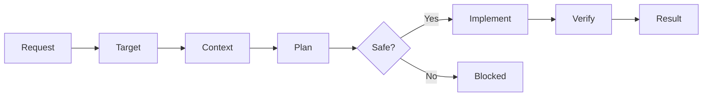

# Copilot Development Workflow

This repository is a clean foundation for turning a plain-language request into a safe, verified change with GitHub Copilot.

The workflow is context- and target-first:

1. The agent resolves which repository, workspace, and asset class the request targets.
2. It reads the relevant business and system context.
3. It identifies unknowns, ownership boundaries, and compatibility risks.
4. It creates a bounded change plan.
5. It implements only the approved scope.
6. A verifier checks the exact target, diff, and evidence.
7. The agent returns a predictable result summary.

## Quick start

1. Complete [business context](docs/business-context.md) and [system map](docs/system-map.md). Unknown items should stay explicitly marked as unknown.
2. In GitHub Copilot Chat, select the `Orchestrator` custom agent.
3. Run `/build` and provide the goal, target, acceptance criteria, constraints, and out-of-scope work.
4. Review target resolution before allowing implementation.
5. Review the returned result: changed behavior, files, validation evidence, compatibility impact, and remaining risks.

For plan-only work, run `/plan-change`. For an independent review of an existing diff, run `/verify-change`.

## Asset ownership map

| Path and repository | Purpose | Default write policy |
| --- | --- | --- |
| `<extension-repo>/.github/**` | Maintainer control plane | Explicit maintainer-workflow request only |
| `resources/copilot/**` | Canonical packaged product source | Product-agent and product-asset changes |
| `src/customization/**` | Preview, write, audit, repair, and upgrade logic | Bounded runtime implementation |
| `<consumer-workspace>/.github/**` | Generated managed ETL assets | Preview, validation, and approval required |
| Temporary consumer workspace | Generated test output | Write-capable tests only |

The same relative path can have different ownership in different repositories. Resolve the workspace root before deciding what a path means.

## Repository map

| Path | Purpose |
| --- | --- |
| `AGENTS.md` | Canonical operating and ownership contract |
| `workflow/targets.yml` | Machine-readable target and write policy |
| `docs/business-context.md` | Business goals, terminology, rules, and invariants |
| `docs/system-map.md` | Components, contracts, asset topology, dependencies, and test map |
| `docs/change-contract.md` | Required before/after contract for non-trivial changes |
| `workflow/README.md` | Workflow phases, states, target resolution, and risk gates |
| `.github/agents/` | Maintainer-only orchestrator, planner, and verifier roles |
| `.github/prompts/` | Maintainer entry points for build, plan, and verification |
| `.github/instructions/` | Always-on business, ownership, coherence, and change-safety guidance |
| `templates/` | Request and result formats |
| `scripts/validate-workflow.mjs` | Cross-platform workflow-contract validation |
| `scripts/assert-control-plane-clean.mjs` | Cross-platform post-test mutation guard |

## Windows and cross-platform behavior

- Validation uses Node rather than Bash and runs from PowerShell, Command Prompt, macOS, Linux, and GitHub Actions.
- Runtime and tests should use `path.resolve()`, `fs.realpath()`, `os.tmpdir()`, `fs.mkdtemp()`, or VS Code URI helpers.
- Do not hard-code `/tmp`, Unix separators, drive letters, or case-sensitive path comparisons.
- Canonicalize paths before checking containment and reject traversal outside the selected workspace.
- Repository globs continue to use `/` because Git and Copilot configuration paths are repository-relative.

## Non-negotiable safety rules

- Never invent business rules, schemas, identifiers, runtime state, acceptance criteria, target identity, or ownership.
- Preserve existing behavior unless the request explicitly changes it.
- Treat an unqualified “agent” request as a product-agent request, not a maintainer-agent change.
- Never edit generated consumer output as canonical source.
- Keep unmanaged consumer files untouched.
- Keep write-capable tests inside temporary consumer workspaces.
- Preserve `@etl /workflow create` and its preview-first, approval-gated generation behavior.
- Report blockers instead of bypassing missing evidence or unavailable tools.

The detailed authority, precedence, and output rules live in [AGENTS.md](AGENTS.md).
