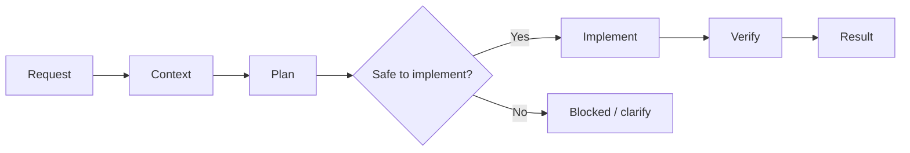

# Copilot Development Workflow

This repository is a clean foundation for turning a plain-language request into a safe, verified change with GitHub Copilot.

The workflow is deliberately context-first:

1. The agent reads the business and system context.
2. It identifies unknowns and compatibility risks.
3. It creates a bounded change plan.
4. It implements only the approved scope.
5. A verifier checks the exact diff and evidence.
6. The agent returns a predictable result summary.



## Quick start

1. Complete [business context](docs/business-context.md) and [system map](docs/system-map.md). Unknown items should stay explicitly marked as unknown.
2. In GitHub Copilot Chat, select the `Orchestrator` custom agent.
3. Run `/build` and add a request in this shape:

```text
Goal: Add ...
Why: ...
Acceptance criteria:
- ...
Constraints:
- ...
Out of scope:
- ...
```

4. Review the returned result: changed behavior, files, validation evidence, compatibility impact, and remaining risks.

For plan-only work, run `/plan-change`. For an independent review of an existing diff, run `/verify-change`.

## Repository map

| Path | Purpose |
| --- | --- |
| `AGENTS.md` | Canonical operating contract for every agent |
| `docs/business-context.md` | Business goals, terminology, rules, and invariants |
| `docs/system-map.md` | Components, contracts, dependencies, and test map |
| `docs/change-contract.md` | Required before/after contract for non-trivial changes |
| `workflow/README.md` | Workflow phases, states, and risk gates |
| `.github/agents/` | Orchestrator, planner, and verifier roles |
| `.github/prompts/` | Easy entry points for build, plan, and verification |
| `.github/instructions/` | Always-on business and change-safety guidance |
| `templates/` | Request and result formats |
| `scripts/validate-workflow.sh` | Checks that the workflow contract remains intact |

## Non-negotiable safety rules

- Never invent business rules, schemas, identifiers, runtime state, or acceptance criteria.
- Preserve existing behavior unless the request explicitly changes it.
- Before changing an existing contract, find its callers and tests or add characterization coverage.
- Keep the implementation diff as small as the requested outcome permits.
- Validate the exact changed artifact set, not a similar example.
- Report blockers instead of bypassing missing evidence or unavailable tools.
- Never hide skipped tests, unresolved risks, or incompatible behavior.

The detailed authority, precedence, and output rules live in [AGENTS.md](AGENTS.md).
