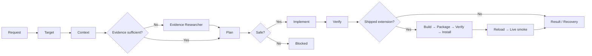

# Copilot Development Workflow

This repository is a clean foundation for turning a plain-language request into a safe, evidence-driven, verified change with GitHub Copilot.

The workflow is context-, evidence-, and target-first:

1. The agent resolves which repository, workspace, and asset class the request targets.
2. It reads the relevant business and system context.
3. When behavior or root cause is unclear, a read-only Evidence Researcher produces a structured evidence packet.
4. It identifies unknowns, ownership boundaries, question provenance, and compatibility risks.
5. It creates a bounded change plan.
6. It implements only the approved scope.
7. A fresh verifier checks the exact target, diff, package/runtime evidence, and regressions.
8. For shipped extension behavior, the same task continues through build, package verification, one local install, activation, and changed-path live smoke verification.
9. The agent returns a predictable result or a bounded recovery checkpoint.

## Quick start

1. Complete [business context](docs/business-context.md) and [system map](docs/system-map.md). Unknown items should stay explicitly marked as unknown.
2. In GitHub Copilot Chat, select the `Orchestrator` custom agent.
3. Run `/build` and provide the goal, target, acceptance criteria, constraints, and out-of-scope work.
4. Review target resolution before allowing implementation.
5. When root cause or runtime behavior is unclear, run `/investigate` or let Orchestrator invoke `Evidence Researcher`.
6. For a `shipped-extension` implementation/fix, do not start a second build/package/install request. The same task should package and locally install the verified VSIX automatically, then stop at `INSTALLED_NOT_ACTIVATED` only when a host reload is required.
7. After reload, resume the same task so it can confirm the active version and run the changed-path live smoke test. `/verify-live-flow` remains available for a standalone operational verification request.
8. Review the returned result: changed behavior, files, validation evidence, compatibility impact, lifecycle state, and remaining risks.

For plan-only work, run `/plan-change`. For an independent review of an existing diff, run `/verify-change`.

## Question-routing rule

Before asking the user for information, the workflow classifies the question as:

- derivable from STTM;
- derivable from the repository;
- an authoritative literal;
- a genuine business decision;
- user approval;
- a tooling gap;
- or a security blocker.

The workflow must not ask the user to paste or reconstruct data that exists in an authorized source but was hidden by truncation, parser limitations, stale state, or missing retrieval tooling.

## Asset ownership map

| Path and repository | Purpose | Default write policy |
| --- | --- | --- |
| `<extension-repo>/.github/**` | Maintainer control plane | Explicit maintainer-workflow request only |
| `resources/copilot/**` | Canonical packaged product source | Product-agent and product-asset changes |
| `src/customization/**` | Preview, write, audit, repair, and upgrade logic | Bounded runtime implementation |
| `<consumer-workspace>/.github/**` | Generated managed ETL assets | Preview, validation, and approval required |
| Temporary consumer workspace | Generated test output | Write-capable tests only |

The same relative path can have different ownership in different repositories. Resolve the workspace root before deciding what a path means.

## Repository map

| Path | Purpose |
| --- | --- |
| `AGENTS.md` | Canonical operating and ownership contract |
| `workflow/targets.yml` | Machine-readable target and write policy |
| `workflow/README.md` | Core lifecycle, states, target resolution, and risk gates |
| `workflow/execution-recovery.md` | Evidence gate, question routing, recovery loop, checkpoints, and new-task rules |
| `workflow/shipped-extension-delivery.md` | Automatic local delivery contract for build, package verification, install, activation, and changed-path smoke of shipped extension changes |
| `docs/business-context.md` | Business goals, terminology, rules, and invariants |
| `docs/system-map.md` | Components, contracts, asset topology, dependencies, and test map |
| `docs/change-contract.md` | Required before/after contract for non-trivial changes |
| `.github/agents/` | Maintainer-only Orchestrator, Evidence Researcher, Planner, and Verifier |
| `.github/prompts/` | Maintainer entry points for build, investigation, planning, verification, and live-flow acceptance |
| `.github/instructions/` | Always-on business, ownership, coherence, change-safety, and recovery guidance |
| `templates/evidence-packet.md` | Standard read-only investigation and handoff format |
| `templates/` | Request and result formats |
| `scripts/validate-workflow.mjs` | Cross-platform workflow-contract validation |
| `scripts/assert-control-plane-clean.mjs` | Cross-platform post-test mutation guard |

## Windows and cross-platform behavior

- Validation uses Node rather than Bash and runs from PowerShell, Command Prompt, macOS, Linux, and GitHub Actions.
- Runtime and tests should use `path.resolve()`, `fs.realpath()`, `os.tmpdir()`, `fs.mkdtemp()`, or VS Code URI helpers.
- Do not hard-code `/tmp`, Unix separators, drive letters, or case-sensitive path comparisons.
- Canonicalize paths before checking containment and reject traversal outside the selected workspace.
- Repository globs continue to use `/` because Git and Copilot configuration paths are repository-relative.

## Non-negotiable safety rules

- Never invent business rules, schemas, identifiers, runtime state, acceptance criteria, target identity, or ownership.
- Preserve existing behavior unless the request explicitly changes it.
- Treat an unqualified “agent” request as a product-agent request, not a maintainer-agent change.
- Never edit generated consumer output as canonical source.
- Keep unmanaged consumer files untouched.
- Keep write-capable tests inside temporary consumer workspaces.
- Preserve `@etl /workflow create` and its preview-first, approval-gated generation behavior.
- Report blockers instead of bypassing missing evidence or unavailable tools.
- Do not repeatedly retry a failed stage without new evidence.
- A shipped-extension implementation/fix owns its bounded local build/package/install/activation/smoke chain; a later standalone operational request is a new task.
- A live failure requiring source or package changes starts a new task.

The detailed authority, precedence, execution, recovery, delivery, and output rules live in [AGENTS.md](AGENTS.md), [workflow/README.md](workflow/README.md), [workflow/execution-recovery.md](workflow/execution-recovery.md), and [workflow/shipped-extension-delivery.md](workflow/shipped-extension-delivery.md).
