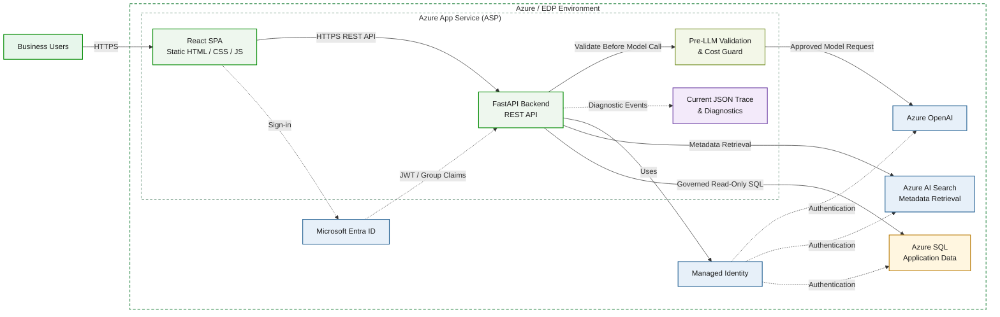

# askAlpha — Current Deployment Architecture

**Status:** Current / implemented POC baseline

This view shows the deployment architecture currently evidenced by the repository deployment skill, deployment guide, and POC review. React build output is represented as static assets served from the same Azure App Service package as the FastAPI backend.

## Architecture diagram

## Current capabilities confirmed by the POC review

- Application-level validation occurs before the model/gateway request so invalid or harmful content can be rejected before incurring model cost.
- Current explainability is primarily machine-readable JSON/diagnostic output showing major decisions, semantic/model queries, selected tables, metadata, and suggested plots.
- The runtime includes a reviewer feedback loop that can return an incomplete answer for another bounded planning/generation attempt.
- Visualization code can run in a sandbox and produce plot artifacts for the response-writing flow.
- Metadata is currently assembled from sources including EDC, data models, Bitbucket assets, and historical queries.

The reviewer and visualization details are logical runtime behaviors and are intentionally not expanded into separate hosting services in this deployment view.

## Known current gaps

- There is no complete built-in user/data/export audit proving who asked what, what governed data was accessed, and what was exported.
- There is no live result cache; repeated questions fetch fresh data from SQL Server.
- Answer quality and generated SQL are still reviewed manually in the POC, and hallucinations have been observed.
- Current evaluation is constrained by access to approximately four tables and must not be represented as enterprise-scale proof.
- Human-readable graphical agent explainability is planned, not current.
- Enterprise monitoring/SIEM integration, Event Hubs, chargeback, Databricks, ADLS, and production cache services are not shown as implemented.

See `docs/plans/SAFETY_OBSERVABILITY_AUDIT_AND_QUALITY_ADDENDUM.md` for required remediation and release gates.

## Assumptions and evidence boundary

- Azure App Service usage is supported by the packaged-config deployment skill, startup script handling, private-endpoint guidance, and the EDP snapshot workflow.
- React is shown in the same App Service because its build produces static HTML/CSS/JavaScript assets packaged with the application.
- Azure SQL, Azure AI Search, Azure OpenAI, Microsoft Entra ID, and Managed Identity are treated as current based on the established Phase 0 and POC context.
- The application-level safety filter complements, and does not replace, approved enterprise LLM Gateway filtering.
- The exact enterprise gateway placement should be confirmed from the private deployment configuration before it is represented as a separate infrastructure component.

## Communication summary

- Browser access uses HTTPS.
- React communicates with FastAPI through an HTTPS REST API.
- Microsoft Entra ID provides user authentication.
- The backend validates the token and authorization context.
- Requests are validated before model calls.
- Azure service access uses Managed Identity or another explicitly approved workload identity.
