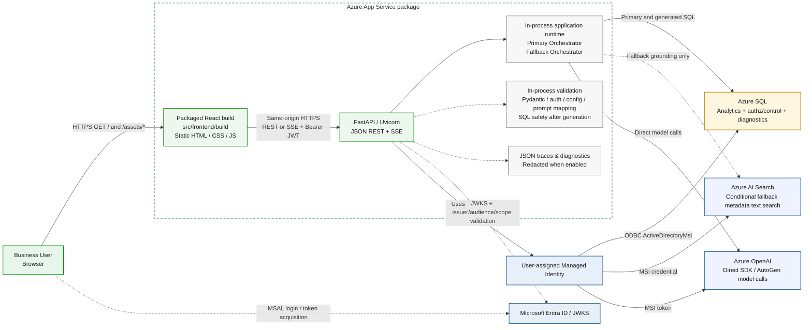

# askAlpha — Current Deployment and Runtime Architecture

**Status:** Current POC deployment/runtime view — repository-verified against `origin/asktd_v2` on 2026-08-04  
**Evidence boundary:** The audit was read-only. The local private-repository worktree was on another branch with edits, so the agent audited `origin/asktd_v2`, which was three commits ahead of the local `asktd_v2` ref. Revalidate this view after material private-runtime changes.

This document contains only components and runtime behavior supported by private-repository code, configuration, packaging, and deployment evidence. Meeting observations are identified separately from code-confirmed facts. Target-state components must not be inferred from this view.

## Architecture diagram

## Confirmed current component status

| Component | Verified status | Current role |
|---|---|---|
| React production build | Current | Vite produces production assets under `src/frontend/build`. CI runs install, tests, and build from the frontend project. |
| React static serving | Current | FastAPI resolves the frontend build directory, mounts static assets at `/`, and supports SPA fallback and asset-cache headers. |
| App Service package | Current | React build output is included in the Python artifact. `startup.sh` starts one Uvicorn/FastAPI application; React is not a separate deployed service. |
| Browser/API communication | Current | Same-origin HTTPS relative calls. JSON endpoints include `/api/config`, `/api/auth/profile`, `/api/chat`, roles/questions/registry APIs; streaming uses `POST /api/chat/stream` with `text/event-stream`, with JSON fallback. |
| Microsoft Entra/MSAL | Current | MSAL runs in the browser, initializes from `/api/config`, uses redirect/silent token acquisition, and stores tokens in session storage. |
| JWT validation | Current | The browser sends `Authorization: Bearer`. FastAPI validates Entra JWTs using PyJWT/JWKS, issuer, audience, scope, group-overage behavior, and a stable user identifier. |
| Live orchestrators | Current | `/api/chat` invokes `handle_chat()`, which builds the primary `Orchestrator` and `FallbackOrchestrator`. |
| Runtime agents | Current, route-dependent | Wired agents include intent routing, registry routing, requirement clarification, report planning, SQL generation, error triage, visualization coding, report/executive writing, and executive review. The fallback path also uses metadata retrieval, SQL safety, and DB execution agents. |
| Azure OpenAI | Current | Model calls go directly through Azure OpenAI SDK/AutoGen configuration to `AZURE_OPENAI_ENDPOINT`. No enterprise LLM Gateway is present in the live code path. |
| Azure SQL | Current | Primary analytics/query execution, SQL-backed available-data stores, authorization/access-management control data, access-change history, SQL diagnostics, and optional client-auth diagnostics. |
| Azure AI Search | Current, conditional fallback | Simple text search over field/table/relationship metadata indexes for fallback/generated-SQL grounding. It is not the primary deterministic path and is not currently vector/hybrid retrieval. |
| Managed Identity | Current | User-assigned Managed Identity is configured. Azure SQL uses `ActiveDirectoryMsi`; Azure OpenAI/Search use managed identity unless approved environment overrides select another supported credential path. |
| JSON traces/diagnostics | Current | Authorized debug responses may include traces, debug panels, executed queries, and redacted SQL. Diagnostic routes expose runtime/SQL information and redacted log tails. These are not a durable user-query audit service. |
| Redis/cache | Configured but unused | Redis host/config mappings exist, but no Redis client/runtime dependency is wired. Current caches are in-process DataFrame/LRU caches. |
| User-query audit | Absent | No durable, explicit user-question audit sink was found. Debug traces/logs do not satisfy this requirement. |
| Data-access audit | Partially implemented | Authorization allow/deny decisions are logged, and access-management mutations have a SQL change log. No complete durable data-read audit/event stream exists. |
| Export audit | Absent | Report download/print behavior is client-side; no backend export route or export audit sink was found. |
| LangSmith | Absent | No source, configuration, or dependency evidence. |
| Azure Sentinel | Absent | No current integration. An internal variable containing the word `SENTINEL` is not Azure Sentinel integration. |
| Dynatrace | Absent | No source, configuration, or dependency evidence. |
| Datadog | Configured but unused | A generic workflow update option exists, but no application-runtime monitoring integration is wired. |
| Event Hubs | Planned | Appears only in target architecture/documentation, not the live runtime. |
| Databricks | Planned | Appears only in MVP/target design, not current source/config/dependencies. |
| ADLS | Planned | Appears only in MVP/target design, not current source/config/dependencies. |
| Usage collector | Planned | Not a current runtime component. |
| Durable outbox | Planned | Not a current runtime component. |

## Exact current runtime sequence

1. CI/CD installs frontend dependencies, runs frontend coverage tests, and builds React.
2. Vite writes production assets to `src/frontend/build`.
3. `MANIFEST.in` includes the React build in the Python artifact; React and FastAPI deploy in one App Service package.
4. App Service runs `startup.sh`, which starts Uvicorn on `SERVER_PORT` or `PORT`.
5. FastAPI registers health/API routes, security/CORS headers, and static SPA serving at `/`.
6. The browser loads `/` and `/assets/*` from the same App Service/FastAPI process.
7. The SPA calls `/api/config` and initializes MSAL when enterprise authentication is enabled.
8. MSAL performs Entra redirect/silent token acquisition for the configured scope.
9. Protected same-origin API calls include the bearer token. Chat supports JSON and SSE.
10. FastAPI performs Pydantic request validation and authentication dependencies before invoking the chat handler.
11. JWT validation resolves Entra JWKS, checks issuer/audience/scope, handles group overage, and creates the trusted user context.
12. When enabled, effective permissions are resolved from SQL-backed access management.
13. `handle_chat()` constructs Azure AI Search, Azure OpenAI, Azure SQL, policy, agent-manager, primary-orchestrator, and fallback-orchestrator dependencies.
14. The primary orchestrator first handles greetings, deny-all authorization, deterministic source plans/recipes, and SQL-backed available-data paths.
15. When fallback/generated SQL is needed, route-dependent agents retrieve metadata from Azure AI Search, generate or repair SQL, validate it with in-process policy/authorization controls, execute against Azure SQL, and format the answer.
16. Model calls go directly to Azure OpenAI; no live enterprise LLM Gateway precedes them.
17. Responses are serialized to JSON-safe payloads. Authorized debug mode can include redacted diagnostic details.
18. The streaming route emits phase events and the final response through SSE.

## Important validation-boundary clarification

There is **no standalone pre-LLM validation microservice** in the current runtime. Current controls are in-process:

- Pydantic/request validation;
- JWT/authentication and authorization checks;
- configuration validation;
- prompt-data preparation/safety logic;
- SQL safety and authorization validation after model-generated SQL and before database execution.

A future product requirement may formalize and strengthen pre-model safety and cost controls, but it must not be represented as a separately deployed current service without code/deployment evidence.

## Do not show as current

- Enterprise LLM Gateway in front of Azure OpenAI.
- Separate React hosting, CDN, Static Web App, or second App Service.
- React as a server-side runtime; React is packaged static build output served by FastAPI.
- Entra sending claims directly to FastAPI; the browser obtains the token and sends the bearer token, while FastAPI validates with Entra JWKS.
- Redis as a live runtime cache.
- Databricks SQL Warehouse or ADLS as current analytical/data services.
- Event Hubs, usage collector, or durable outbox as current telemetry components.
- LangSmith, Azure Sentinel, Dynatrace, or Datadog runtime integration.
- Complete user-query, data-read, or export auditing.
- Vector/hybrid Azure AI Search retrieval.
- A standalone validation service.

## Current POC limitations observed in the review meeting

These are meeting-derived limitations and remain subject to repository/environment verification where applicable:

- The demonstrated POC covered approximately four tables.
- Quality checking was largely manual, and hallucinations were acknowledged.
- Identical questions are not served from a distributed result cache.
- Current JSON diagnostics are not the same as explainability visualization or a compliance-grade audit trail.

These limitations do not automatically reopen technically completed Phase 0. They become explicit Beta/production requirements unless a current security or correctness defect is confirmed.
