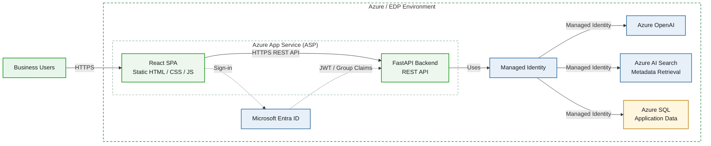

# askAlpha — Current Deployment Architecture

**Status:** Current / implemented baseline

This diagram shows the deployment architecture currently evidenced by the repository deployment skill and deployment guide. React build output is represented as static assets served from the same Azure App Service package as the FastAPI backend.

## Architecture diagram

## Assumptions and evidence boundary

- Azure App Service usage is supported by the packaged-config deployment skill, startup script handling, private-endpoint guidance, and the EDP snapshot workflow.
- React is shown in the same App Service because its build produces static HTML/CSS/JavaScript assets packaged with the application.
- Azure SQL, Azure AI Search, Azure OpenAI, Microsoft Entra ID, and Managed Identity are treated as current based on the established Phase 0 context.
- Redis, Databricks, ADLS, Event Hubs, Application Gateway, and chargeback are not shown as current.

## Communication summary

- Browser access uses HTTPS.
- React communicates with FastAPI through an HTTPS REST API.
- Microsoft Entra ID provides user authentication.
- The backend validates token and authorization context.
- Azure services use Managed Identity or another explicitly approved workload identity.
