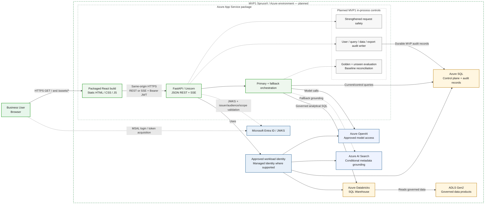

# askAlpha — MVP1 SpruceX Architecture

**Status:** Planned / dependent on access, data-product onboarding, and approval  
**Baseline dependency:** This view evolves the verified current architecture. It does not redefine current hosting, identity, or model-access behavior without new repository/platform evidence.

MVP1 keeps React static assets and FastAPI in one Azure App Service package, preserves the browser-MSAL-bearer-token flow, and adds approved access to initial Databricks/ADLS governed data products. It also introduces the minimum audit and quality controls required before broader business testing with restricted data.

## Architecture diagram

## What MVP1 adds to the verified current baseline

- SpruceX onboarding and approved network/firewall path.
- DAC/data-product approval and identity mapping.
- One initial Azure Databricks SQL Warehouse analytical execution path.
- ADLS-backed governed data products.
- Source-qualified authorization for the pilot data product.
- Durable minimum audit for user, question, authorization scope, accessed objects, result/export action, and outcome.
- Golden and unseen-question evaluation, including reconciliation against trusted source queries or baseline reports.
- Explicit hallucination/error taxonomy and approved acceptance thresholds.
- Bounded reviewer retries, timeout, token budget, and safe-stop behavior.
- Hardened visualization code execution where code-based charts are enabled.

## Current behavior that remains unchanged unless separately approved

- React remains packaged static output served by FastAPI in the same App Service package.
- The browser obtains an Entra token through MSAL and sends the bearer token to FastAPI.
- FastAPI validates JWTs using Entra JWKS and resolves effective authorization.
- JSON and SSE remain the browser/API response mechanisms.
- Azure AI Search remains conditional fallback metadata grounding, not the primary analytical engine.
- Current model calls go directly to Azure OpenAI. An enterprise model gateway must not be shown or introduced without explicit platform/IAM approval and repository implementation evidence.

## MVP1 dependencies and open confirmations

- SpruceX user and service access.
- Firewall/private-network reachability.
- DAC approval and named data owners.
- Availability of Databricks SQL Warehouse and Unity Catalog capabilities.
- Approved App Service-to-Databricks workload identity.
- Catalog/schema/object authorization model.
- Data freshness, reconciliation, and pilot SLO.
- Audit retention, access, and SIEM/monitoring destination.

## Explicitly outside this MVP1 view

- Cross-source joins.
- Redis as a required runtime dependency.
- Event Hubs, durable outbox, and enterprise-scale telemetry pipeline.
- Formal showback or chargeback.
- Application Gateway/WAF unless separately approved for this stage.
- Rich Power BI replacement or pixel-perfect reporting.

## MVP1 exit evidence

MVP1 is not complete merely because a database connection succeeds. Exit requires:

1. authenticated and authorized pilot-user access;
2. one governed data product queried through the approved Databricks path;
3. fail-closed object and row-scope behavior;
4. durable user/query/data/export audit evidence;
5. golden and unseen-question thresholds;
6. baseline reconciliation;
7. sandbox-security evidence for code-generated visualization;
8. bounded reviewer/model-call behavior;
9. operational diagnostics and rollback evidence;
10. explicit Product, Data, Security, Architecture, QA, Platform, and Operations sign-off for the pilot.
