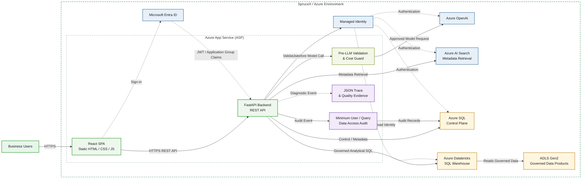

# askAlpha — MVP1 SpruceX Architecture

**Status:** Planned / dependent on access, onboarding, and pilot quality evidence

This diagram shows the intended MVP1 state after SpruceX onboarding and approved access to the initial governed data products. It preserves the current App Service boundary while adding Databricks and ADLS for analytical execution and introducing the minimum safety, audit, and quality evidence required for controlled business-user testing.

## Architecture diagram

## MVP1 quality and audit gates

MVP1 is not complete merely because connectivity to a data product works. The pilot must also demonstrate:

- application-level validation before every model/gateway call;
- fail-closed authorization for the selected source, dataset, objects, fields, and row scope;
- minimum user/query/data-access audit tied to a trusted request ID;
- reviewed golden questions and unseen questions;
- comparison against existing trusted reports or source queries;
- expected semantic-plan and SQL characteristics;
- hallucination/error classification and release thresholds;
- bounded reviewer feedback loops with observable stop conditions;
- safe visualization-sandbox controls where generated code is used;
- clear disclosure of data coverage, known limitations, and freshness.

Broad business-user testing with restricted data must not begin until the audit and authorization gates are satisfied.

## Assumptions and evidence boundary

- MVP1 depends on SpruceX access, networking/firewall readiness, DAC approvals, data-product onboarding, and an approved App Service-to-Databricks identity.
- Azure SQL remains the control plane; Databricks SQL becomes the analytical execution engine for onboarded data products.
- The audit shown here is the minimum MVP1 control. The final enterprise architecture keeps user/data/export audit, agent/LLM trace, and model-usage metering as separate correlated streams.
- Cross-source joins, advanced caching, Event Hubs, formal chargeback, broad self-service publishing, and rich dashboards are outside this MVP1 view.
- This is planned architecture and must not be described as already implemented.
- Report-rationalization commitments must be based on reconciled pilot evidence, not only on a successful demonstration.

## Communication summary

- Browser access uses HTTPS.
- React communicates with FastAPI through an HTTPS REST API.
- Microsoft Entra ID provides user authentication.
- The backend validates the token and authorization context.
- Requests are validated before model calls.
- Azure service access uses Managed Identity or another explicitly approved workload identity.

See `docs/plans/SAFETY_OBSERVABILITY_AUDIT_AND_QUALITY_ADDENDUM.md` for the controlling requirements.
