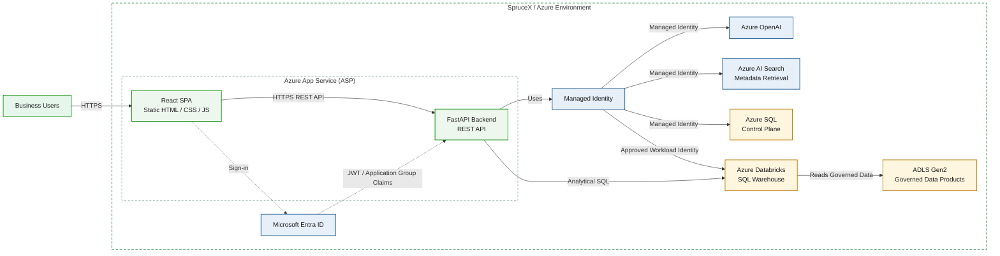

# askAlpha — MVP1 SpruceX Architecture

**Status:** Planned / dependent on access and onboarding

This diagram shows the intended MVP1 state after SpruceX onboarding and approved access to the initial governed data products. It preserves the current App Service boundary while adding Databricks and ADLS for analytical execution.

## Architecture diagram

## Assumptions and evidence boundary

- MVP1 depends on SpruceX access, networking/firewall readiness, DAC approvals, data-product onboarding, and an approved App Service-to-Databricks identity.
- Azure SQL remains the control plane; Databricks SQL becomes the analytical execution engine for onboarded data products.
- Cross-source joins, advanced caching, Event Hubs, chargeback, and rich dashboards are outside this MVP1 view.
- This is planned architecture and must not be described as already implemented.

## Communication summary

- Browser access uses HTTPS.
- React communicates with FastAPI through an HTTPS REST API.
- Microsoft Entra ID provides user authentication.
- The backend validates token and authorization context.
- Azure services use Managed Identity or another explicitly approved workload identity.
