# askAlpha — Target Enterprise Production Architecture

**Status:** Target / future-state design

This diagram shows the proposed enterprise production target with controlled ingress, centralized authorization and semantic planning, secure caching, multi-source analytics, and recoverable usage/audit processing.

## Architecture diagram

```mermaid
flowchart LR
    user["Business Users"]

    subgraph azure["Target Enterprise Azure Architecture"]
        direction LR

        gateway["Azure Application Gateway<br/>WAF"]

        subgraph hosting["Azure App Service"]
            direction TB
            react["React SPA"]
            api["FastAPI Backend"]
            policy["Authorization & Policy"]
            planner["Semantic Planning"]
            meter["Usage Collector"]
            outbox["Durable Outbox"]
            react -->|"HTTPS REST API"| api
            api --> policy --> planner
            api --> meter --> outbox
        end

        entra["Microsoft Entra ID"]
        mi["Managed Identity"]
        openai["Azure OpenAI"]
        search["Azure AI Search"]
        cache["Approved Cache Provider<br/>Redis-Compatible"]
        sql["Azure SQL<br/>Control Plane"]
        dbsql["Azure Databricks<br/>SQL Warehouse"]
        adls["ADLS Gen2<br/>Delta / Audit / Artifacts"]
        events["Azure Event Hubs"]
        reporting["Showback / Chargeback<br/>Operational Reporting"]

        gateway --> react
        api -->|"Uses"| mi
        mi --> openai
        mi --> search
        mi --> sql
        mi --> dbsql
        mi --> cache
        mi --> events

        planner -->|"Metadata / Policies"| sql
        planner -->|"Candidate Retrieval"| search
        planner -->|"Model Calls"| openai
        planner -->|"Governed Analytical SQL"| dbsql
        dbsql -->|"Governed Data Products"| adls
        api -->|"Scope-Aware Cache"| cache

        outbox -.->|"Usage & Audit Events"| events
        events -.->|"Streaming Ingestion"| dbsql
        dbsql -.->|"Usage Aggregates"| adls
        adls -.->|"Reconciled Usage"| reporting
    end

    user -->|"HTTPS"| gateway
    react -.->|"Sign-in"| entra
    entra -.->|"JWT / Application Group Claims"| api

    classDef user fill:#e7f6eb,stroke:#008a00,stroke-width:1.5px,color:#1a1a1a;
    classDef app fill:#eef7ee,stroke:#008a00,stroke-width:1.5px,color:#1a1a1a;
    classDef azure fill:#e7f0f9,stroke:#205e91,stroke-width:1.5px,color:#1a1a1a;
    classDef data fill:#fff6e0,stroke:#b77800,stroke-width:1.5px,color:#1a1a1a;
    classDef telemetry fill:#f3eafa,stroke:#6f42a5,stroke-width:1.5px,color:#1a1a1a;

    class user user;
    class react,api,policy,planner app;
    class gateway,entra,mi,openai,search,cache azure;
    class sql,dbsql,adls data;
    class meter,outbox,events,reporting telemetry;

    style azure fill:#ffffff,stroke:#64a878,stroke-width:2px,stroke-dasharray:6 4
    style hosting fill:#ffffff,stroke:#9ab7a7,stroke-width:1.5px,stroke-dasharray:5 4
```

## Assumptions and evidence boundary

- The first production version should remain within one approved application security boundary where practical.
- Application Gateway, Event Hubs, cache, and operational reporting remain subject to SpruceX, Security, Platform, and lifecycle approval.
- Authorization must be fail-closed and applied before aggregation, caching, visualization, reporting, and export.
- Showback must precede formal chargeback.

## Communication summary

- Browser access uses HTTPS.
- React communicates with FastAPI through an HTTPS REST API.
- Microsoft Entra ID provides user authentication.
- The backend validates token and authorization context.
- Azure services use Managed Identity or another explicitly approved workload identity.
