# askAlpha — Target Enterprise Production Architecture

**Status:** Target / future-state design — subject to IAM, SpruceX, Security, Data, Platform, Operations, and lifecycle approval

This view starts from the repository-verified current application boundary rather than inventing a separate frontend runtime. It adds controlled ingress, fine-grained authorization, semantic planning, multi-source analytics, secure caching, durable event delivery, production-grade audit, automated quality controls, and enterprise operations.

No target component in this diagram should be represented as currently deployed unless the private repository and target environment provide direct evidence.

## Architecture diagram

```mermaid
flowchart LR
    user["Business User<br/>Browser"]

    subgraph azure["Target enterprise Azure architecture — approval-dependent"]
        direction LR

        gateway["Azure Application Gateway<br/>WAF / controlled ingress"]

        subgraph app["Azure App Service application boundary"]
            direction TB
            react["Packaged React build<br/>Static assets"]
            api["FastAPI / Uvicorn<br/>JSON REST + SSE"]
            authz["Authorization & policy"]
            planner["Semantic planning"]
            reviewer["Bounded answer-quality reviewer"]
            sandbox["Hardened visualization sandbox"]

            subgraph streams["Distinct correlated record streams"]
                usage["Model usage collector"]
                accessAudit["User / data / export audit"]
                agentTrace["Agent / LLM decision trace"]
            end

            outbox["Durable outbox"]

            react -->|"Same-origin HTTPS<br/>REST or SSE + Bearer JWT"| api
            api --> authz --> planner
            planner --> reviewer
            reviewer -.->|"Bounded feedback"| planner
            planner -.-> sandbox
            api -.-> usage
            api -.-> accessAudit
            planner -.-> agentTrace
            usage --> outbox
            accessAudit --> outbox
            agentTrace --> outbox
        end

        entra["Microsoft Entra ID / JWKS"]
        mi["Managed Identity / approved workload identity"]
        openai["Azure OpenAI<br/>Approved model access"]
        search["Azure AI Search<br/>Bounded candidate retrieval"]
        cache["Approved cache provider<br/>Authorization-scope-aware"]
        sql["Azure SQL<br/>Control plane"]
        dbsql["Azure Databricks SQL Warehouse<br/>Governed analytical execution"]
        eventproc["Databricks event processing"]
        adls["ADLS Gen2<br/>Governed data + audit/usage history"]
        events["Azure Event Hubs<br/>Asynchronous event transport"]
        operations["Approved enterprise monitoring / SIEM"]
        reporting["Showback + reconciliation<br/>Chargeback only after approval"]

        gateway --> react
        api -->|"Uses"| mi
        mi --> openai
        mi --> search
        mi --> cache
        mi --> sql
        mi --> dbsql
        mi --> events

        planner -->|"Metadata / KPI / policy"| sql
        planner -->|"Authorized candidate retrieval"| search
        planner -->|"Model calls"| openai
        planner -->|"Governed analytical SQL"| dbsql
        dbsql -->|"Governed data products"| adls
        api -->|"Authorized-result cache only"| cache

        outbox -.->|"Usage / audit / trace events"| events
        events -.-> eventproc
        eventproc -.->|"Curated append-only history"| adls
        adls -.-> operations
        adls -.-> reporting
    end

    user -->|"HTTPS"| gateway
    user -.->|"MSAL login / token acquisition"| entra
    api -.->|"JWKS + issuer/audience/scope validation"| entra

    classDef actor fill:#e7f6eb,stroke:#008a00,stroke-width:1.5px,color:#1a1a1a;
    classDef app fill:#eef7ee,stroke:#008a00,stroke-width:1.5px,color:#1a1a1a;
    classDef control fill:#f7f7f7,stroke:#777777,stroke-width:1.2px,color:#1a1a1a;
    classDef identity fill:#e7f0f9,stroke:#205e91,stroke-width:1.5px,color:#1a1a1a;
    classDef data fill:#fff6e0,stroke:#b77800,stroke-width:1.5px,color:#1a1a1a;
    classDef telemetry fill:#f3eafa,stroke:#6f42a5,stroke-width:1.5px,color:#1a1a1a;
    classDef ai fill:#eef3ff,stroke:#205e91,stroke-width:1.5px,color:#1a1a1a;

    class user actor;
    class react,api app;
    class authz,planner,reviewer,sandbox,outbox control;
    class entra,mi,gateway identity;
    class sql,dbsql,eventproc,adls data;
    class usage,accessAudit,agentTrace,events,operations,reporting telemetry;
    class openai,search,cache ai;

    style azure fill:#ffffff,stroke:#64a878,stroke-width:2px,stroke-dasharray:6 4
    style app fill:#ffffff,stroke:#9ab7a7,stroke-width:1.5px,stroke-dasharray:5 4
    style streams fill:#ffffff,stroke:#6f42a5,stroke-width:1.1px,stroke-dasharray:3 3
```



## Architectural principles

1. **One approved application boundary first.** React static assets and FastAPI remain inside one approved App Service boundary where practical. Do not split into independently authenticated services without a justified ADR and IAM approval.
2. **Browser-mediated identity.** The browser obtains the Entra token through MSAL and sends the bearer token to FastAPI. FastAPI validates it with Entra JWKS and creates the trusted user context.
3. **Managed Identity for Azure resources.** Use Managed Identity or another explicitly approved workload identity. Do not introduce unapproved API keys, secrets, or custom app-to-app authentication.
4. **Authorization before discovery and execution.** Filter metadata candidates, datasets, fields, joins, SQL, cache entries, traces, reports, charts, and exports by effective authorization.
5. **Fail closed.** Missing or invalid entitlement returns no data.
6. **Deterministic before generative.** Preserve curated recipes and typed rendering for common/high-risk questions; use generated SQL only as a bounded fallback.
7. **Source-neutral orchestration.** The semantic plan selects an approved adapter; normal orchestration must not branch on database-specific implementation details.
8. **Security before caching.** Only authorized results enter cache. Keys include the effective authorization scope and policy/data versions.
9. **Three distinct telemetry records.** User/data/export audit, agent/LLM trace, and model usage are correlated but not conflated.
10. **Showback before chargeback.** Formal chargeback requires complete metering, reconciliation, approvals, and controlled financial close.

## Application layer

### React and FastAPI

- React remains static build output.
- FastAPI serves static assets and the API.
- Browser/API communication supports JSON REST and SSE streaming.
- Protected calls carry the bearer token.

### Authorization and semantic planning

The trusted user context resolves:

- subject and tenant;
- application-assigned group object IDs;
- direct/user entitlements where approved;
- dataset/table/field access;
- row scopes;
- export/report/admin permissions;
- authorization version.

The semantic planner produces an inspectable plan before data execution, including source, dataset, fields, joins, grain, filters, KPI definitions, limits, output intent, and clarification reason.

### Reviewer feedback loop

The reviewer may return a response for correction, but the loop must be bounded by:

- maximum attempts;
- elapsed-time limit;
- token/cost budget;
- permitted repair types;
- explicit stop reason;
- safe fallback or clarification.

### Visualization sandbox

Any code-executing visualization path must enforce:

- default-deny network access;
- restricted filesystem and working directory;
- library allowlist;
- CPU, memory, process, and execution-time limits;
- input/output size and type validation;
- artifact sanitization and cleanup;
- no credential or host-environment access;
- malicious-code regression tests.

## Data and metadata architecture

### Azure SQL control plane

Recommended responsibilities:

- business/semantic metadata registry;
- KPI, glossary, examples, instructions, and templates;
- entitlement mappings and authorization versions;
- workflow, approval, publish, rollback, and emergency-disable state;
- durable outbox state;
- audit/control indexes;
- source registry and capability metadata.

### Databricks and ADLS data plane

Recommended responsibilities:

- governed analytical data products;
- Databricks SQL execution;
- Unity Catalog technical metadata and policies;
- Delta data and aggregate tables;
- schema discovery and drift signals;
- usage/audit processing and curated history.

Technical metadata remains owned by the enterprise data platform. askAlpha owns business and semantic metadata and references/imports technical metadata rather than creating a competing catalog.

### Azure AI Search

Target use remains bounded candidate retrieval for glossary, examples, instructions, and metadata. It must not become the analytical execution engine, and current simple text search must not be described as vector/hybrid retrieval unless implemented and approved.

## Audit, trace, and usage streams

### User/data/export audit

Must answer:

- who asked;
- what operation was requested;
- what effective authorization was used;
- which source/dataset/table/field objects were accessed;
- whether rows/results were returned;
- whether an export/download occurred;
- outcome, time, environment, and correlation IDs.

It must not store raw sensitive result rows unless a separate approved records requirement exists.

### Agent/LLM decision trace

Captures route, plan, agent transitions, validation outcomes, retries, reviewer feedback, redacted prompts/metadata references where approved, and safe diagnostics.

### Model usage metering

Captures every actual provider call, including retry, repair, fallback, escalation, shadow, and reviewer calls. It records provider-observed usage, model/deployment, policy version, latency, status, and organizational attribution without raw prompts, responses, SQL literals, results, tokens, or secrets.

All three streams use common request/trace identifiers but have separate schemas, retention, access control, and reporting purposes.

## Event transport and processing

```text
Collectors
  → Durable Outbox
  → Azure Event Hubs
  → Databricks Event Processing
  → ADLS Curated History
  → Monitoring / Audit / Showback / Reconciliation
```

Event Hubs is asynchronous event transport. It is not the user-query engine, metadata store, or source of analytical answers.

## Secure cache contract

A result-cache key must include at least:

- environment;
- source and dataset;
- semantic-plan/query hash;
- authorization-scope hash;
- authorization version;
- row/column policy version;
- metadata/KPI version;
- data-freshness version;
- output shape.

No unrestricted result may be cached and filtered only in the UI.

## Approval-dependent components

The following remain target choices until approved and implemented:

- Application Gateway/WAF and private-backend topology;
- Event Hubs;
- managed Redis-compatible cache technology;
- Databricks/ADLS usage-history pipeline;
- selected enterprise SIEM/monitoring integration;
- formal showback/chargeback;
- any enterprise LLM Gateway in front of Azure OpenAI.

## Production release gates

- IAM-approved application registration and token topology.
- Managed Identity/workload-identity matrix.
- Fine-grained authorization and row-level security for restricted data.
- Complete user/query/data/export audit.
- Automated golden/unseen evaluation and reconciliation thresholds.
- Visualization-sandbox security evidence.
- Secure cache isolation/freshness tests if cache is enabled.
- Durable event delivery, replay, idempotency, and dead-letter evidence.
- SLOs, monitoring, alerting, runbooks, backup, recovery, canary, and rollback.
- Product, Security, Architecture, Data, QA, Platform/DevOps, Operations, and Finance approval where chargeback is in scope.
