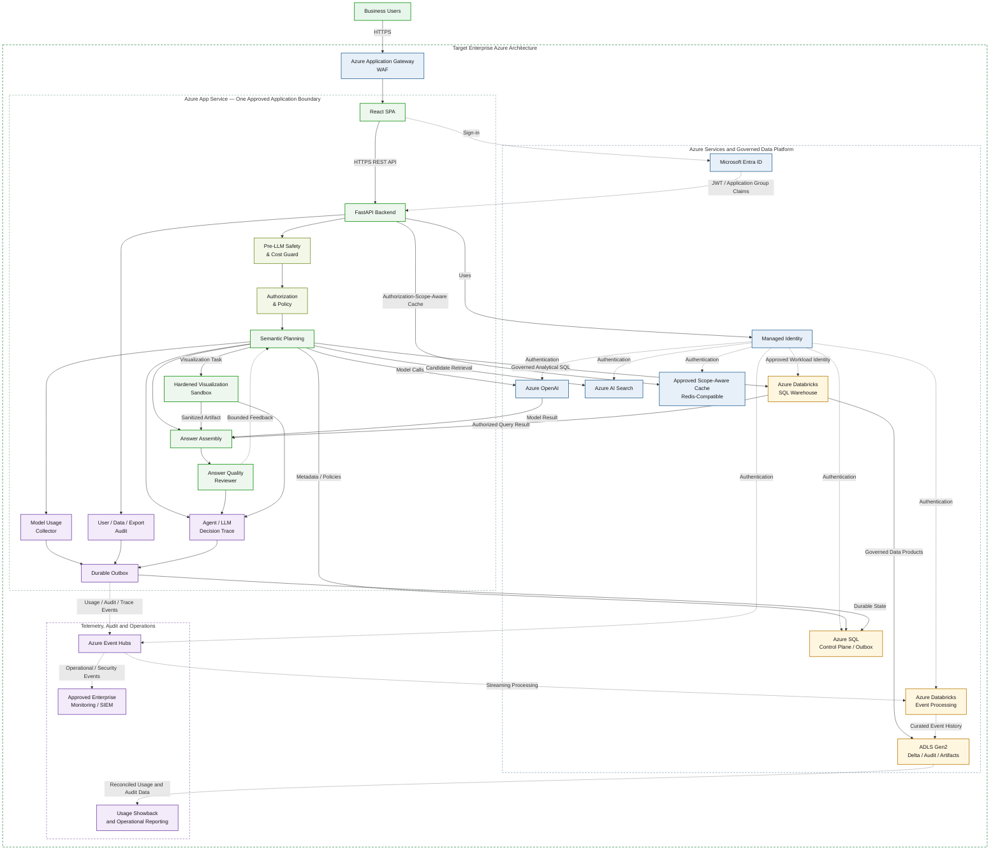

# askAlpha — Target Enterprise Production Architecture

**Status:** Target / future-state design

This diagram shows the proposed enterprise production target with controlled ingress, application-level safety, fail-closed authorization, semantic planning, answer review, hardened visualization execution, secure caching, multi-source analytics, and three distinct correlated operational streams:

1. user/data/export audit;
2. agent/LLM decision trace;
3. model usage metering.

None of these target components should be described as implemented without private-repository and environment evidence.

## Architecture diagram



## Main request path

```text
User
  -> Gateway/WAF
  -> React
  -> FastAPI
  -> Pre-LLM Safety and Cost Guard
  -> Authorization and Policy
  -> Semantic Planning
  -> Governed model/data execution
  -> Answer Assembly
  -> Answer Quality Review
  -> Approved Response or Bounded Feedback
```

The reviewer may request another bounded planning/generation attempt, but it cannot weaken authentication, authorization, privacy, SQL safety, or resource limits.

## Three distinct correlated record streams

### 1. User, data-access, and export audit

Answers:

- who made the request;
- which authorization scope was effective;
- which governed sources, datasets, objects, and fields were accessed;
- whether the request was denied;
- what result shape was returned;
- whether data was exported and with what outcome.

This stream is mandatory for restricted-data Beta and production use.

### 2. Agent and LLM decision trace

Answers:

- which route, plan, metadata, KPI, and policy versions were used;
- which model calls, retries, repairs, reviewer decisions, and sandbox steps occurred;
- why the answer passed, failed, clarified, or stopped safely.

The human-readable trace must not expose hidden reasoning, raw sensitive prompts, unauthorized metadata, SQL literals, or result rows.

### 3. Model usage metering

Answers:

- which actual model/deployment was called;
- which agent and route initiated it;
- provider-observed input/output/total tokens;
- latency, retry, fallback, escalation, and status;
- organizational attribution and estimated/reconciled cost state.

Showback must precede chargeback.

All three streams share request and trace correlation IDs but retain separate schemas, access controls, retention, and ownership.

## Event Hubs responsibility

Azure Event Hubs is an asynchronous transport for explicitly approved usage, audit, trace, feedback, and operational events. It is not the user-facing analytical query engine.

The target event path is:

```text
Collectors
  -> Durable Outbox
  -> Azure Event Hubs
  -> Databricks Event Processing
  -> ADLS Curated History
  -> Monitoring, Audit, Showback, and Reconciliation
```

Outbox, replay, idempotency, dead-letter handling, and recovery must be tested before the event path becomes a release dependency.

## Visualization sandbox requirements

Generated visualization code must execute in an isolated environment with:

- no unrestricted outbound network access;
- no application secrets or cloud credentials;
- allowlisted packages and file types;
- CPU, memory, runtime, output-size, and chart-point limits;
- temporary isolated storage;
- artifact sanitization, scanning, cleanup, and retention controls;
- regression testing for malicious code and sandbox escape.

## Cache requirements

The cache is optional until benchmark and security approval. If enabled, it must:

- store only authorized results;
- include the effective authorization-scope hash in the key;
- include authorization, row/column policy, metadata, KPI, and freshness versions;
- invalidate safely after access or policy changes;
- expose hit/miss, stale, isolation, and kill-switch telemetry;
- never rely on browser-only filtering of unrestricted cached data.

## Answer evidence and confidence

Do not present an uncalibrated probability percentage as proof of correctness. Prefer evidence indicators such as:

- semantic-plan validation;
- source and data freshness;
- metadata/KPI version;
- SQL-safety result;
- authorization result;
- reviewer coverage result;
- baseline reconciliation status;
- known limitations and unresolved ambiguity.

## Assumptions and evidence boundary

- The first production version should remain within one approved application security boundary where practical.
- Application Gateway, Event Hubs, cache technology, Databricks event processing, enterprise monitoring/SIEM, and operational reporting remain subject to SpruceX, Security, Platform, and lifecycle approval.
- The approved enterprise model gateway may sit between the application and Azure OpenAI; its exact placement must be verified from the private deployment design.
- Authorization must be fail-closed and applied before aggregation, caching, visualization, reporting, and export.
- Event transport and monitoring tools must not be represented as implemented merely because they appear in this target diagram.
- Showback must precede formal chargeback.

## Production release implications

Production is blocked unless:

- pre-LLM safety controls pass bypass tests;
- user/data/export audit completeness is proven;
- agent/LLM traces and model-usage events are redacted and access-controlled;
- golden and unseen-question evaluation meets approved thresholds;
- pilot answers reconcile against trusted baseline reports or source queries;
- reviewer loops are bounded and observable;
- visualization sandbox security tests pass;
- cache isolation and invalidation pass if cache is enabled;
- Event Hubs/outbox recovery passes if event transport is enabled;
- enterprise monitoring and operational ownership are approved;
- rollback and emergency-disable procedures are demonstrated.

See `docs/plans/SAFETY_OBSERVABILITY_AUDIT_AND_QUALITY_ADDENDUM.md` for the controlling product requirements.

## Communication summary

- Browser access uses HTTPS.
- React communicates with FastAPI through an HTTPS REST API.
- Microsoft Entra ID provides user authentication.
- The backend validates token and authorization context.
- Application validation occurs before model calls.
- Azure services use Managed Identity or another explicitly approved workload identity.
